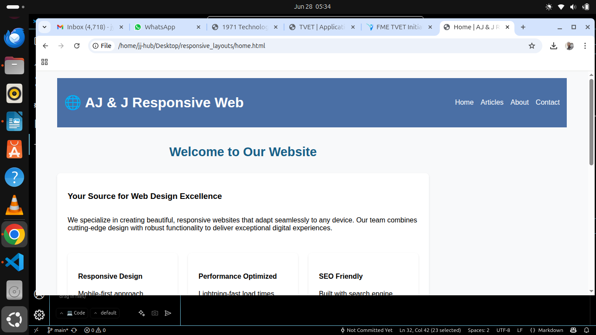
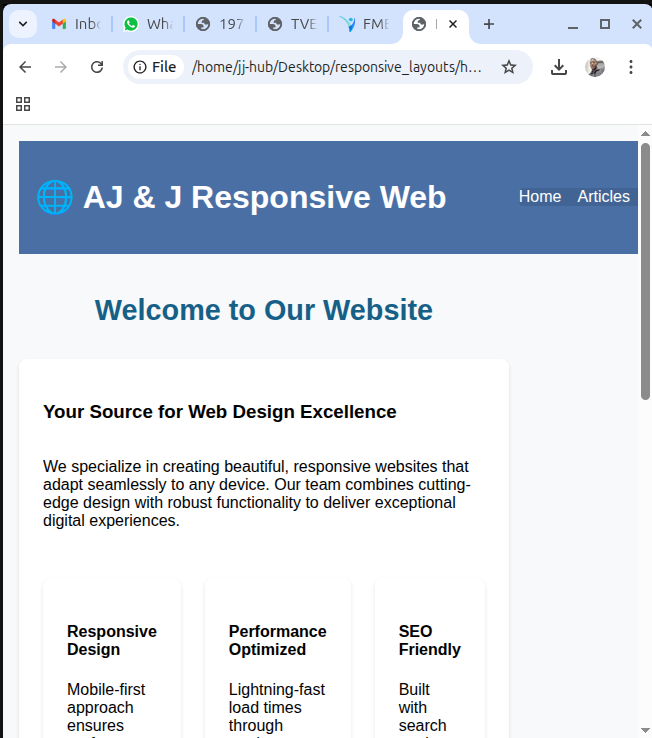
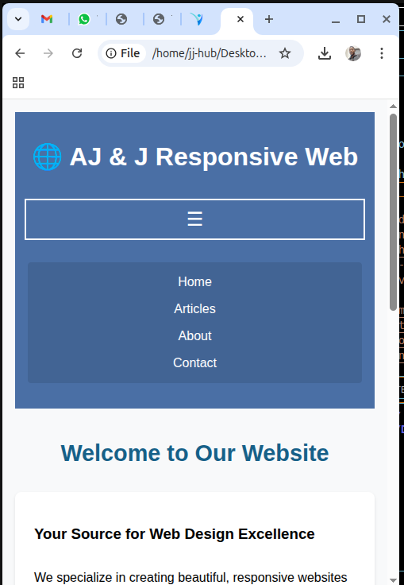

Federal University Education Olosoho Website
This is a responsive front-end website for the fictional Federal University Education Olosoho, designed using HTML, CSS, and JavaScript. It showcases the university's features such as admissions, student portal, gallery, and contact information.
🌐 Live Preview
(Optional – Add your deployment URL here if hosted on GitHub Pages, Vercel, Netlify, etc.)

📁 Project Structure
project-root/
├── index.html
├── about.html
├── admission.html
├── contact.html
├── student.html
├── css/
│   └── styles.css
├── assets/
│   └── images/
│       ├── Desktop.png
│       ├── Mobile.png
│       └── Tablet.png

📌 Features
    • ✅ Responsive design across desktop, tablet, and mobile
    • ✅ Dropdown menus for Admission and Student sections
    • ✅ Gallery section with campus images
    • ✅ Newsletter subscription form
    • ✅ Contact information and social links in the footer
    • ✅ Accessible layout with semantic HTML5

🛠 Technologies Used
    • HTML5 – Structure
    • CSS3 – Styling and responsiveness
    • Vanilla JavaScript – Menu toggle functionality

🚀 How to Use
    1. Clone the Repository
       git clone https://github.com/IA-LINK/responsive_layouts
       
    2. Open in Browser
Simply open index.html in any modern web browser.

📷 Screenshots
(Optional – Add screenshots of the desktop, tablet, and mobile views)

✍️ Author
Ikwogya Ayika James
Email: jyc.kom@gmail.com
Phone: 07077390949

📜 License
This project is for educational purposes only. Feel free to customize it for your institution or portfolio.

Let me know if you’d like the README exported as a downloadable file or formatted for GitHub display.


---

```markdown
AJ & J Responsive Web Layout

A fully responsive and accessible website showcasing modern web design principles. This layout is ideal for blogs, article-based sites, or educational content. It demonstrates semantic HTML5 structure, CSS Grid & Flexbox layout, and mobile-first responsiveness without requiring build tools or frameworks.

 🌟 Features

- ✅ Mobile-first responsive design
- 🧱 Clean semantic HTML5
- 🎨 Modern CSS with Grid and Flexbox
- 🧭 Accessible navigation with ARIA
- 🌐 Cross-browser compatibility
- 🔍 Search bar and newsletter section
- 📰 Dynamic article grid and featured content
- 📌 Sidebar with quick links

 📁 Project Structure

```

.
├── index.html
├── home.html
├── articles.html
├── about.html
├── contact.html
├── README.md
├── css/
│   └── style.css
└── images/
└── screenshots/
├── desktop.png
├── tablet.png
└── mobile.png

````

 🛠 Setup

1. Clone this repository:
   ```bash
   git clone https://github.com/your-username/aj-j-responsive-layout.git
````

2. Open `index.html` in any modern browser.
3. No dependencies or build tools required – works out of the box.

 📸 Screenshots

| Desktop                                         | Tablet                                        | Mobile                                        |
| ----------------------------------------------- | --------------------------------------------- | --------------------------------------------- |
|  |  |  |

 🚀 Deployment

 🔹 GitHub Pages

1. Create a GitHub repository.
2. Push these files to the `main` branch.
3. Go to **Settings > Pages**.
4. Under "Source", select `Deploy from branch`, then choose `main`.

Your site will be live at `https://your-username.github.io/your-repo-name`.

 🔸 Netlify Deployment

1. Sign up at [Netlify](https://app.netlify.com).
2. Drag & drop your project folder onto the dashboard
   **OR** connect your GitHub/GitLab repo:

   * Click **“New site from Git”**
   * Select your Git provider & repository
   * Leave build settings blank (no build needed)
   * Click **“Deploy site”**
3. Your site will be available at `https://[your-site-name].netlify.app`

➡️ To use a custom domain:

* Go to **Domain Settings** > **Add custom domain**
* Follow domain verification steps

> 💡 Netlify auto-deploys your changes whenever you push to your linked repository.

 📌 Customization Tips

* Replace `https://via.placeholder.com/...` images with real assets
* Update articles and content blocks in the HTML files
* Add integrations (e.g. newsletter logic) using services like Formspree, Mailchimp, etc.

 📄 License

MIT License © 2025 AJ & J Team

```

---

Let me know if you'd like to include a table of contents, badges (for Netlify/GitHub Pages), or contributors section.
```
